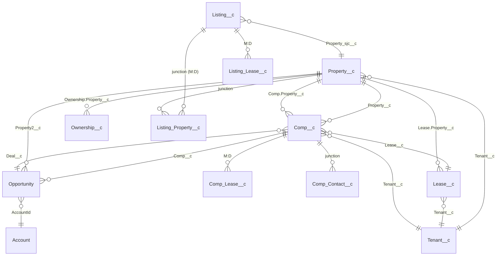

# LCC Salesforce Schema Reference

**Source:** `Salesforce Schema Mapping.xlsx` (Scott's Object Manager + Fields/Relationships export)
**Org:** Northmarq / LCC (custom fields carry the `_sjc__c` suffix)
**Ingested:** July 21, 2026
**Companion file:** `salesforce_schema_catalog.json` — the machine-readable version of everything here (334 objects indexed, 2,818 fields across the 17 detailed objects). The MCP mapping layer should read the JSON; this doc is for humans.

> **How to keep this current:** re-export the same Object Manager + field views from Salesforce, drop the workbook in, and regenerate the JSON. The catalog is the single source of truth for field API names when we write the query flow and the canonical mapping.

---

## 1. The headline finding

The core CRE objects are **native custom objects with no Ascendix/managed-package namespace prefix** — which means the Power Automate Salesforce connector (or any query) can read them directly by their plain API names. Ascendix is confirmed to be just a search/export layer on top; it's not in the data path. Three of the "objects" are actually **standard Salesforce objects wearing CRE labels**, which matters for how we query them:

| Your label | Real API name | Object type | Notes |
|---|---|---|---|
| Deal | **`Opportunity`** | Standard | Heavily customized; uses standard `StageName` **plus** many `_sjc__c` stage/status fields |
| Company | **`Account`** | Standard | All company/owner/broker orgs |
| Contacts | **`Contact`** | Standard | People |
| Comp | `Comp__c` | Custom | **The primary comp-data object — rich and self-contained** |
| Comp Lease | `Comp_Lease__c` | Custom | Master-detail child of Comp (per-tenant lease lines on a comp) |
| Comp Relationship | `Comp_Contact__c` | Custom | Comp ↔ Contact/Company junction |
| Property | `Property__c` | Custom | The hub everything hangs off |
| Listing | `Listing__c` | Custom | On-market listings; very wide (`_sjc__c` heavy) |
| Listing Lease | `Listing_Lease__c` | Custom | Master-detail child of Listing |
| Listing Property | `Listing_Property__c` | Custom | **Junction: Listing ↔ Property (many-to-many)** |
| Lease | `Lease__c` | Custom | Lease terms; links to Property + Tenant |
| Tenant | `Tenant__c` | Custom | Tenant master |
| Ownership | `Ownership__c` | Custom | Property ↔ Company ↔ Deal ownership mapping |

---

## 2. The relationship model (Property is the hub)

**The relationship fields you'll actually query on** (from → field → target):

- `Comp__c.Property__c` → Property  *(the main comp-to-property link)*
- `Comp__c.Deal__c` → Opportunity, `Comp__c.Lease__c` → Lease, `Comp__c.Tenant__c` → Tenant
- `Comp__c.Buyer_Company__c` / `Seller_Company__c` → Account; `Buyer_Contact__c` / `Seller_Contact__c` / `Buyer_Broker__c` / `Seller_Broker__c` → Contact
- `Lease__c.Property__c` → Property, `Lease__c.Tenant__c` → Tenant
- `Listing__c.Property_sjc__c` → Property (and `Listing_Property__c` for the many-to-many)
- `Opportunity.Property2__c` → Property, `Opportunity.Comp__c` → Comp, `Opportunity.AccountId` → Account
- `Ownership__c.Property__c` / `.Account__c` / `.Deal__c` → Property / Company / Deal

---

## 3. Comp__c — the primary object, with a starter canonical mapping

`Comp__c` is self-contained enough that a **sales-comp pull can hit this one object** (joining to Property only for enrichment). Here's the starter map from the canonical comp schema (design doc §2) to the real fields:

| Canonical field | Comp__c field | Notes / watchout |
|---|---|---|
| `property_type` | `Property_Type__c` (Picklist) | **Need the value list** — see §5 |
| `property_subtype` | `Primary_Use__c` (Picklist) | Label is "Property Subtype" |
| `comp_type` | `Comp_Type__c` (Picklist) | sale vs lease vs other — **need values** |
| `building_sf` | `Building_SF__c`; also `Total_Building_SF__c` (formula) | sector splits exist: `Office_SF__c`, `Industrial_SF__c`, `Retail_SF__c`, `Multifamily_SF__c`, `Other_SF__c` |
| `sale_price` | **`Price__c`** (raw Currency) | Prefer raw `Price__c` over the formulas `Comp_Price__c` / `Price_Formula__c` for querying |
| `price_per_sf` | `Price_SF__c` (formula) | Derived — read for display, don't write |
| `cap_rate` | **`Cap_Rate__c`** (raw Percent) | Many cap formulas exist (`Comp_Cap_Rate__c`, `Cap_Rate_Formula__c`) — raw is `Cap_Rate__c` |
| `noi` | `NOI__c` | |
| `occupancy_at_sale` | `Occupancy__c` | |
| `sale_date` | `Sold_Date__c` | also `Contract_Executed_Date__c` |
| `base_rent_annual` | `Annual_Rent__c` | for lease comps |
| `rent_per_sf` | `Rent_SF__c` (formula) | |
| `lease_type` / escalations | `Rent_Type__c`, `Escalation_Type_New__c` | |
| `city` / `state` / `zip` | `City__c` / `State__c` (Picklist) / `Postal_Code__c` | |
| `tenant_name` | via `Tenant__c` lookup → Tenant | |
| `record_link` | `X18Id__c` (18-char Id formula) | build the deep link from record Id |
| `confidence` / quality | **`Validation_Status__c`, `Last_Verified_Date__c`, `Status__c`, `On_Market__c`** | see §4 — this is how we filter to trustworthy comps |
| `days_on_market` | `Days_on_Market__c` (formula) | |
| `raw` | (entire record) | keep it |

`Comp_Lease__c` (master-detail child) holds per-tenant lease lines when a comp is multi-tenant — pull it when `comp_type = lease` and the comp has multiple tenants.

---

## 4. Data-quality watchouts (important for a trustworthy tool)

The export surfaced several things the query/mapping layer must respect:

- **Built-in quality flags — use them.** `Validation_Status__c`, `Last_Verified_Date__c`, `Status__c`, and `On_Market__c` on Comp let us filter to *closed, validated* comps and exclude on-market/unverified ones. This is the default quality gate the synthesis tool should apply. **I need the value sets to wire it (§5).**
- **"DO NOT USE" / "Do Not Use" fields are deprecated.** Several fields carry these labels (e.g. Comp `Rent_SF_Display__c`, `of_Tenants__c`; Property `Office_Rentable_Sq_Ft__c`, `Apartment_Rentable_Sq_Ft__c`, `Tenant_s__c`; Property `Key_Principal__c`). The mapping must **avoid** these.
- **Raw vs formula duplicates.** Many measures exist as both a raw field and one or more formula variants (price: `Price__c` vs `Comp_Price__c`/`Price_Formula__c`; cap: `Cap_Rate__c` vs `Cap_Rate_Formula__c`/`Comp_Cap_Rate__c`). **Query the raw field; display the formula.** We should lock which is authoritative per measure with you.
- **Swapped labels on Property.** `Retail_SF__c` is labeled "Retail Rentable Sq Ft" while `Retail_Rentable_Sq_Ft__c` is labeled "Retail SF" — the label/API-name pairing is crossed. Worth a human confirming which holds the real number before we map Property SF.
- **Duplicate address fields.** Property has both `Zip_Code__c` and `Postal_Code__c`, and both `Submarket__c` (text) and `Sub_Market__c` (picklist). Comp uses `Postal_Code__c`. We standardize on one each in the canonical layer.
- **Deal (Opportunity) is heavily customized.** It has standard `StageName` **plus** `Deal_Stage_sjc__c`, `Status_sjc__c`, `Deal_Type_sjc__c`, and several sale-price/cap-rate variants (`Final_Sale_Price__c`, `Sale_Price_sjc__c`). For *comp* purposes, prefer `Comp__c` as the source of truth and treat Deal as context, not the comp record.

---

## 5. What I still need from you to finish the mapping and build

The export gave me structure (objects, fields, types, relationships) — which was the hard part. Three gaps remain, in priority order:

**(1) Picklist VALUE lists (highest priority).** The export shows a field is a `Picklist` but not its options. I need the actual values for these, so the controlled vocabularies and the quality filter can be built:

- `Comp__c.Property_Type__c` and `Primary_Use__c` (subtype)
- `Comp__c.Comp_Type__c` (so I know how sale vs lease vs land is encoded)
- `Comp__c.Validation_Status__c` and `Status__c` (which values = "trustworthy, usable comp")
- `Comp__c.Rent_Type__c` and `Escalation_Type_New__c` (for lease comps)
- `Property__c.Property_Type__c` / `Primary_Use__c` / `Market__c` (to confirm they align to Comp's)

*Easiest way: Setup → Object Manager → Comp → Fields → click each field → copy the "Values" list. Or just include them in the sample export below by having a few rows that cover the common types.*

**(2) A few real sample rows (still the best shortcut).** 5–15 real `Comp__c` records exported with values (redact anything confidential) tells me how fields are actually populated, confirms which price/cap field carries the real number, and reveals the picklist values in situ. One Comp export + one Lease export would resolve most open questions at once.

**(3) Two quick confirmations:**
- **Attachments:** are OMs/flyers on comps/listings stored as modern **Salesforce Files** (`ContentDocumentLink`) or classic **Attachments**? (Determines how the tool fetches them later.)
- **Power BI:** is any of this Comp/Property/Listing data already in a **Power BI dataset/dataflow**, and how often does it refresh? If yes, we may query that for market-level rollups instead of hitting Salesforce record-by-record.

---

## 6. What this unlocks (updated build path)

With this schema in hand, the plan tightens:

1. **Canonical mapping table** — I can now author `Comp__c → canonical` (and Lease/Property enrichment) as a data file the moment the picklist values land. Section 3 is the draft.
2. **Power Automate query flow** — spec it against real fields: query `Comp__c` filtered by `Property_Type__c`, `State__c`, `Sold_Date__c` window, `Validation_Status__c`, with a lookup expansion to `Property__c`/`Tenant__c`. No Connected App, no Ascendix API.
3. **Drop the old Connected App phase** from the main design doc; Power Automate (+ optional Power BI) is the permanent read surface.

The single most useful next thing you can send: **the Comp picklist values + one sample Comp export.** That closes the loop on the mapping and lets me write the actual query.
